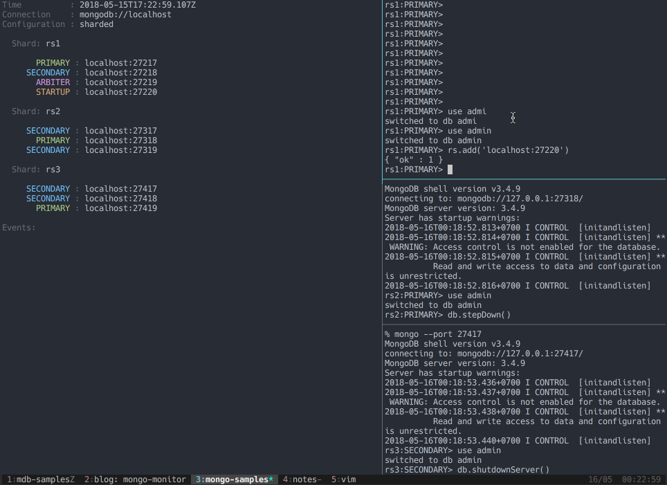

# mongo-monitor

[](https://circleci.com/gh/dwmkerr/mongo-monitor) [](https://codecov.io/gh/dwmkerr/mongo-monitor) [](https://greenkeeper.io/)

Simple CLI to monitor the status of a MongoDB cluster.

```bash
mongo-monitor mongodb://address:27017
```



The connection string is handled with [`mongo-connection-string`](https://github.com/dwmkerr/mongo-connection-string), which means it'll handle input which is not URI encoded.

Install with:

```bash
npm install mongo-monitor
```

## Usage

The monitor is primary designed to show the status of a MongoDB cluster, updated real-time. This is useful when performing administrative operations such as replicaset or shard configuration.

On a sharded cluster, if you provide a connection string with admin priviledges to any `mongos` host, you will see the sharding configuration.

On a replicaset, if you provide a connection string with admin priviledges to any host, or to the entire set, you will see the replicaset configuration:


For a standalone, basic info is reported. Sharded clusters show details of the shards, as welll as the replicasets which make up each shard:


## Samples

To try the monitor out, there are a few samples you can try.

Monitor a standalone instance:

```bash
make sample-standalone
mongo-monitor localhost:271017
```

Monitor a replicaset:

```bash
make sample-replicaset
mongo-monitor localhost:27017,localhost:27018,localhost:27019?replicaSet=cluster
```

Monitor a sharded cluster:

```bash
make sample-shard
mongo-monitor localhost
```

Cleanup sample processes:

```bash
make sample-shutdown
```

## Developing

Lint with `npm run lint`, test with `npm test`, release with `npm run release`.

## Tests

The following files are useful for testing:

| File | Notes |
|------|-------|
| `shard.isMaster.json` | The output of `isMaster` for a `mongos` member of a sharded cluster. | 
| `shard.listShards.json` | The output of `listShards` for a `mongos` member of a sharded cluster. | 
| `shard.node.isMaster.json` | The output of `isMaster` for a `mongod` member of a sharded cluster. | 

## Troubleshooting

```bash
mongo-monitor : command not found
```

You need to change the npm config prefix

```bash
npm config set prefix /usr/local

npm root -g
```


## Notes

There's also a little blog post on this here: [dwmkerr.com/mongo-monitor-cli/](https://www.dwmkerr.com/mongo-monitor-cli/).
